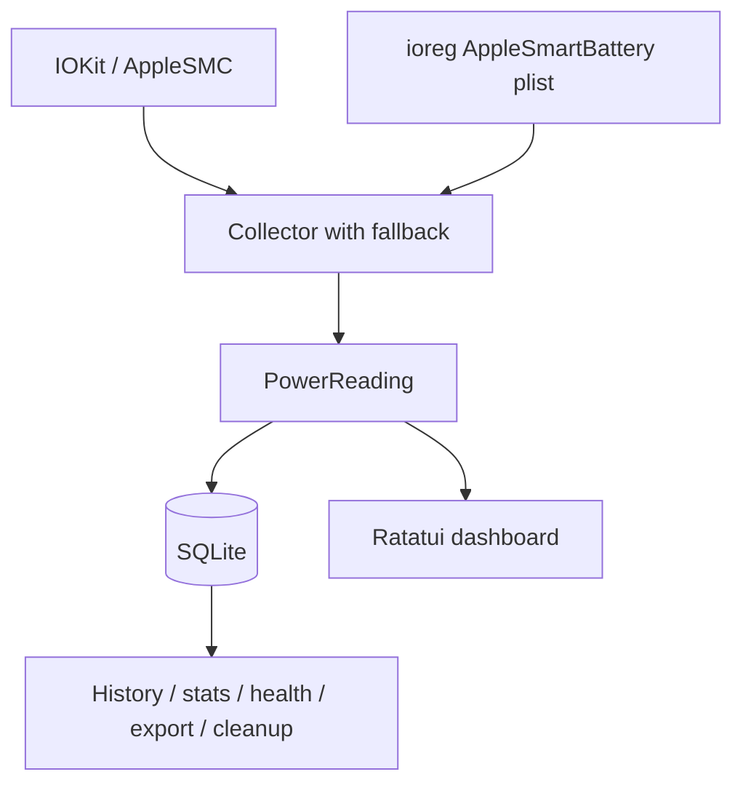

# pwer ⚡🔋

`pwer` is a native Rust macOS battery and power monitor with a real-time terminal dashboard, SQLite history, and CSV or JSON export.

It reads Apple SMC power sensors through IOKit when available and falls back to `ioreg` battery data.

## Features

- Live charging or discharging power, battery capacity, voltage, current, charger details, and status.
- Adaptive Ratatui dashboard with rolling statistics and a power chart.
- Local SQLite history compatible with databases created by the original Python implementation.
- Scriptable history, statistics, health, cleanup, and export commands.
- Forgiving runtime configuration and strict configuration validation.
- Direct IOKit/SMC collection with automatic `ioreg` fallback.

## Requirements

- macOS on Apple Silicon or Intel.
- Rust 1.88 or newer when building from source.
- No root privileges for normal collection, though individual SMC sensors depend on model and system access.

The CLI data commands can read an existing database on other platforms, but live collection and the dashboard require macOS.

## Install

Install from crates.io:

```bash
cargo install pwer
```

Install from a local checkout:

```bash
cargo install --path .
```

## Quick start

Launch the dashboard:

```bash
pwer
```

Collect every two seconds:

```bash
pwer --interval 2
```

Use larger rolling windows:

```bash
pwer --stats-limit 200 --chart-limit 120
```

Enable debug logging:

```bash
pwer --debug
```

## Dashboard controls

| Key | Action |
| --- | --- |
| `Q` or `Esc` | Quit |
| `R` | Request an immediate refresh |
| `C` | Clear saved history |

The dashboard chooses a stacked, side-by-side, or compact stacked layout based on terminal dimensions.

## Commands

```bash
pwer export readings.csv
pwer export readings.json --limit 1000
pwer stats
pwer history --limit 50
pwer health --days 30
pwer cleanup --days 30
pwer cleanup --all
pwer config init
pwer config show
pwer config validate
```

Run `pwer COMMAND --help` for exact options.

## Configuration

The optional config file is `~/.pwer/config.toml`.

```toml
[tui]
interval = 1.0
stats_limit = 100
chart_limit = 60

[database]
path = "~/.pwer/pwer.db"

[cli]
default_history_limit = 20
default_export_limit = 1000

[logging]
level = "INFO"
```

Configuration priority is CLI arguments, then the config file, then built-in defaults.

Runtime loading falls back field by field when a value is invalid.

`pwer config validate` reports malformed tables, unknown keys, unknown sections, and invalid values as errors.

## Data and privacy

Readings and logs remain local under `~/.pwer/` by default.

The application sends no telemetry and makes no network requests.

The SQLite table retains timestamp, electrical measurements, battery capacities, charging state, and optional charger metadata.

Use `pwer cleanup --days N` for retention or `pwer cleanup --all` to clear all readings after confirmation.

## Architecture



See [`docs/architecture.md`](docs/architecture.md) for module boundaries and data flow.

## Development

Run the local quality gate:

```bash
cargo fmt --all --check
cargo clippy --all-targets --all-features -- -D warnings
cargo test --all-targets --all-features
cargo package
```

Live collector validation requires macOS.

Parser, database, configuration, CLI, and layout tests run on Linux CI.

## License

MIT
