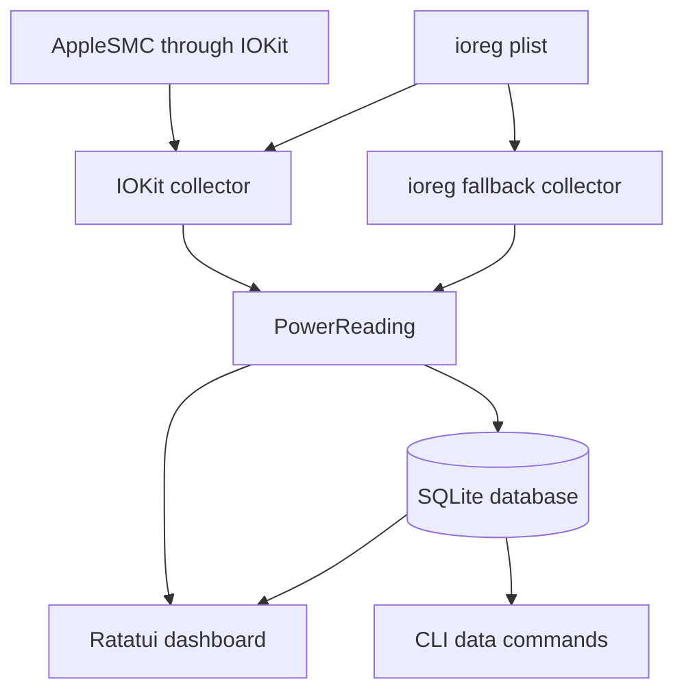

# Architecture

`pwer` is a single Rust binary with modules separated by responsibility.

## High-level flow

## Modules

- `src/main.rs` parses startup state, initializes logging, and converts failures to process exit codes.
- `src/cli.rs` defines Clap arguments and implements export, stats, cleanup, history, health, and config commands.
- `src/config.rs` validates runtime values and loads `~/.pwer/config.toml`.
- `src/models.rs` defines the serializable `PowerReading` value.
- `src/database.rs` owns schema creation and all SQLite operations.
- `src/collector/ioreg.rs` executes `ioreg` and parses the returned plist.
- `src/collector/smc.rs` owns macOS-only IOKit FFI and SMC sensor access.
- `src/collector/smc_parser.rs` decodes big-endian SMC value formats on every test platform.
- `src/tui.rs` owns the event loop, adaptive layout, live data, statistics, and chart rendering.

## Collection

The default macOS collector attempts these SMC keys: `PPBR`, `PDTR`, `PSTR`, `PHPC`, `PDBR`, `TB0T`, and `CHCC`.

When `PDTR` is available, it replaces voltage-times-current as the live power value.

Battery capacity, voltage, current, charging state, and charger metadata still come from `ioreg -rw0 -c AppleSmartBattery -a`.

Any SMC failure causes the reading to fall back to plain `ioreg` collection.

Live collection is conditionally compiled for macOS so Linux CI can build and test the rest of the application.

## Persistence

`Database::open` creates `power_readings` and the descending `idx_timestamp` index if needed.

The schema matches the original Python application.

Timestamp parsing accepts RFC 3339 and legacy Python/Peewee timestamp text.

SQLite `datetime()` and `date()` functions normalize both formats for cleanup and health queries.

## TUI

The collector runs on a worker thread so `ioreg` does not block terminal input and drawing.

The main TUI thread owns SQLite access and widget state.

A channel carries readings or collector failures from the worker.

The terminal uses a stacked layout at `60×40` or larger, a side-by-side summary at `71×24` or larger when the stacked layout does not fit, and a compact stacked layout otherwise.
